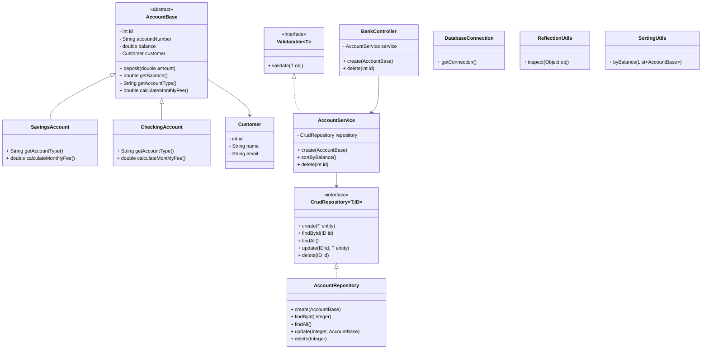

# Bank System (Assignment 4)

## 📌 Project Overview

This project is a **Bank System** implemented in **Java** using **SOLID principles**, **Advanced OOP**, **JDBC**, **Generics**, **Lambdas**, and **Reflection**.
The system allows managing bank accounts and customers with a clean layered architecture.

The project fully satisfies **Assignment 4 requirements**.

---

## 🏗 Architecture

The project follows a **layered architecture**:

* **Model** – domain entities (Account, Customer)
* **Repository** – data access layer (JDBC)
* **Service** – business logic and validation
* **Controller** – delegation layer
* **Utils** – helpers (DB, reflection, sorting)
* **Exception** – custom runtime exceptions

Dependency flow:

```
Controller → Service → Repository → Database
```

---

## 📁 Project Structure

```
bank-system-solid
└── src
    ├── controller
    │   └── BankController.java
    ├── service
    │   ├── AccountService.java
    │   └── interfaces
    │       └── Validatable.java
    ├── repository
    │   ├── AccountRepository.java
    │   └── interfaces
    │       └── CrudRepository.java
    ├── model
    │   ├── AccountBase.java
    │   ├── SavingsAccount.java
    │   ├── CheckingAccount.java
    │   └── Customer.java
    ├── exception
    │   ├── InvalidInputException.java
    │   ├── DuplicateResourceException.java
    │   ├── ResourceNotFoundException.java
    │   └── DatabaseOperationException.java
    ├── utils
    │   ├── DatabaseConnection.java
    │   ├── ReflectionUtils.java
    │   └── SortingUtils.java
    └── Main.java
```

---

## 🧠 SOLID Principles Applied

### SRP – Single Responsibility Principle

* Each class has one responsibility (Controller, Service, Repository).

### OCP – Open/Closed Principle

* New account types can be added without modifying existing logic.

### LSP – Liskov Substitution Principle

* `SavingsAccount` and `CheckingAccount` correctly extend `AccountBase`.

### ISP – Interface Segregation Principle

* `Validatable` and `CrudRepository` are small and focused.

### DIP – Dependency Inversion Principle

* Service layer depends on repository interfaces, not implementations.

---

## ⚙ Technologies Used

* Java 17+
* PostgreSQL
* JDBC
* IntelliJ IDEA
* Git & GitHub

---

## 🗄 Database Schema

```sql
CREATE TABLE customers (
    id SERIAL PRIMARY KEY,
    name VARCHAR(100),
    email VARCHAR(100) UNIQUE
);

CREATE TABLE accounts (
    id SERIAL PRIMARY KEY,
    account_number VARCHAR(20) UNIQUE,
    balance DECIMAL(10,2),
    type VARCHAR(20),
    customer_id INT REFERENCES customers(id)
);
```

---

## ▶ How to Run

1. Create PostgreSQL database `bank_db`
2. Run SQL schema
3. Update credentials in `DatabaseConnection.java`
4. Add PostgreSQL JDBC driver to classpath
5. Run `Main.java`

---

## 🔍 Reflection Example

The project uses **RTTI (Reflection)** to inspect objects at runtime:

* Prints class name
* Prints declared methods

Implemented in `ReflectionUtils.inspect()`.

---

## 🧪 Example Output

```
model.SavingsAccount
getAccountType
calculateMonthlyFee
deposit
getId
getAccountNumber
getBalance
getCustomer
```

---

## ✅ Assignment 4 Checklist

* SOLID principles ✔
* Abstract classes ✔
* Interfaces (default + static) ✔
* Generics ✔
* Lambdas & Streams ✔
* Reflection ✔
* JDBC ✔
* Clean architecture ✔

---

## 📊 UML Class Diagram (Text)



---

## 👨‍🎓 Author

Batyrkhan

---

## 🏁 Conclusion

This project demonstrates a clean, extensible, and maintainable Java application that fully complies with **Assignment 4** requirements and showcases advanced object-oriented programming concepts.
